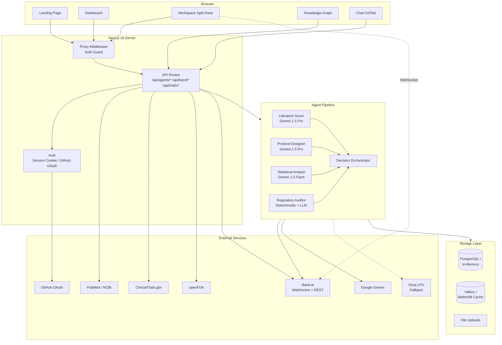
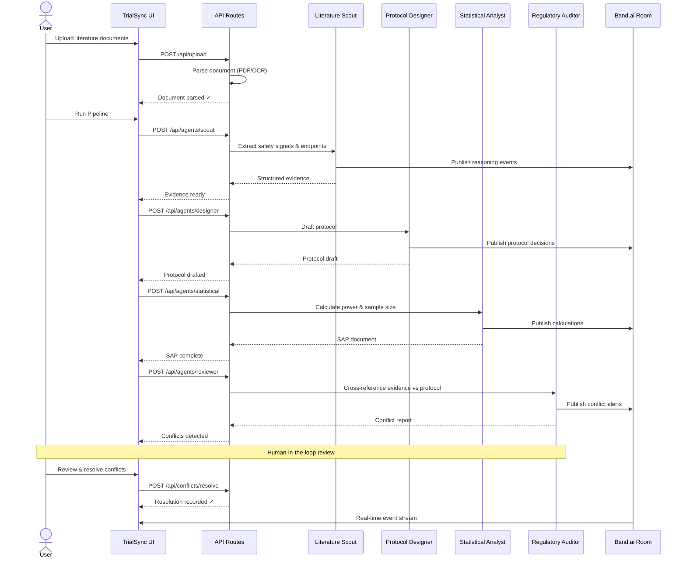
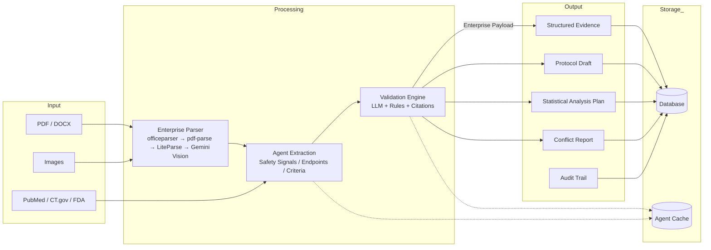

<div align="center">
  <picture>
    <source media="(prefers-color-scheme: dark)" srcset="https://img.shields.io/badge/TrialSync-The%20Operating%20System%20for%20Clinical%20Trials-7c3aed?style=for-the-badge&logo=phoenix&logoColor=white&labelColor=1e1b4b">
    
  </picture>

  <br />

  **Multi-Agent Clinical Trial Design Platform** — powered by AI orchestration

  <p align="center">
    <a href="https://trialsync.vercel.app">Live Demo</a>
    ·
    <a href="#architecture">Architecture</a>
    ·
    <a href="#agents">Agents</a>
    ·
    <a href="#quick-start">Quick Start</a>
    ·
    <a href="#pitch-deck">Pitch Deck</a>
  </p>

  <br />

  
  
  
  
  
  
  

  <br />
  <br />

  <a href="https://trialsync.vercel.app">
    
  </a>
</div>

---

## Overview

TrialSync is an **AI-powered clinical trial design platform** where four specialized AI agents collaborate in real time — from literature review through protocol drafting, statistical analysis, and regulatory compliance — all orchestrated via [Band.ai](https://band.ai) for human-in-the-loop oversight.

> Built for the **Band.ai × Google Gemini Hackathon 2026**.

---

## Features

| Feature | Description |
|---------|-------------|
| **Multi-Agent Pipeline** | Literature Scout → Protocol Designer → Statistical Analyst → Regulatory Auditor |
| **Band.ai Orchestration** | Real-time agent coordination with live WebSocket event streaming |
| **Conflict Detection** | Multi-layer LLM + rule-based + citation mapping engine |
| **Knowledge Graph** | Physics-based force-directed visualization of all trial artifacts |
| **Document Ingestion** | PDF, DOCX, XLSX, PPTX, and OCR via LiteParse/Gemini Vision |
| **Live Data Sources** | PubMed, ClinicalTrials.gov, openFDA API integration |
| **21 CFR Part 11 Audit Trail** | Immutable, searchable, exportable compliance logs |
| **Agent Reasoning Viewer** | Expandable Thought → Action → Observation → Decision paths |
| **Dark / Light Mode** | Persistent theme with smooth CSS transitions |
| **Inline Editing** | Edit protocol and SAP in place with downstream re-triggering |
| **Slash Commands** | `/sync`, `/fix alt`, `/fix renal`, `/fix endpoint`, `/fix all` |
| **Chat Assistants** | Context-aware workspace CoPilot + global platform chat |
| **Enterprise Adapters** | CDISC SDTM, eCTD, Veeva Vault, Benchling, SAS |

---

## Architecture

### System Architecture



### Agent Pipeline Flow



### Data Flow



---

## Agents

Four specialized AI agents collaborate in sequence, each publishing its reasoning to Band.ai for real-time human visibility.

### Literature Scout
| | |
|---|---|
| **Model** | Gemini 1.5 Pro |
| **Role** | Extracts safety signals (ALT, eGFR, QTc), efficacy rates, population criteria |
| **Input** | Uploaded documents + PubMed search results |
| **Output** | Structured evidence brief with citations |
| **Fallback** | Groq Llama 3.1 70B |

### Protocol Designer
| | |
|---|---|
| **Model** | Gemini 1.5 Pro |
| **Role** | Drafts inclusion/exclusion criteria, primary/secondary endpoints, flagged assumptions |
| **Input** | Literature Scout evidence output |
| **Output** | Protocol document (editable, versioned) |
| **Fallback** | Groq Llama 3.1 70B |

### Statistical Analyst
| | |
|---|---|
| **Model** | Gemini 1.5 Flash (fast path) |
| **Role** | Calculates power analysis, sample size (chi-square), endpoint timing validation |
| **Input** | Protocol draft |
| **Output** | Statistical Analysis Plan (SAP) |
| **Fallback** | Groq Llama 3.1 8B |

### Regulatory Auditor
| | |
|---|---|
| **Model** | Custom deterministic + rule-based + LLM |
| **Role** | Cross-references protocol vs. evidence, detects conflicts (e.g., exclusion contradicts literature) |
| **Input** | Evidence + Protocol + SAP |
| **Output** | Conflict report with severity levels + recommended fixes |
| **Fallback** | N/A (deterministic core always works) |

---

## Tech Stack

| Layer | Technology |
|-------|-----------|
| **Framework** | Next.js 16 (App Router, Turbopack) |
| **Language** | TypeScript |
| **Styling** | Tailwind CSS 4 + CSS custom properties |
| **AI / LLM** | Google Gemini 1.5 Pro/Flash, Groq LPU (fallback) |
| **Orchestration** | Band.ai (WebSocket + REST + Agent API) |
| **Database** | PostgreSQL (via `pg`) / In-memory (fallback, seeded with 6 landmark trials) |
| **Cache** | Valkey (Redis-compatible) / BetterDB in-memory (`cache_store.json`) |
| **Document Parsing** | officeparser, pdf-parse, mammoth, LiteParse (native OCR) |
| **Auth** | Session cookies + GitHub OAuth |
| **Icons** | Lucide React |
| **Animation** | Framer Motion |
| **Deployment** | Vercel |

---

## Project Structure

```
src/
├── app/
│   ├── api/
│   │   ├── agents/           # Agent endpoints (scout, designer, reviewer, statistical, chat)
│   │   ├── auth/             # Demo login & GitHub OAuth
│   │   ├── band/             # Band.ai integration (rooms, link, register, pipeline-event)
│   │   ├── clinicaltrials/   # ClinicalTrials.gov proxy
│   │   ├── conflicts/        # Conflict resolution
│   │   ├── openfda/          # openFDA safety labels proxy
│   │   ├── pubmed/           # PubMed search proxy
│   │   ├── trials/           # Trial CRUD + update
│   │   ├── upload/           # File upload handler
│   │   ├── chat/             # General platform chat
│   │   └── auth/             # Demo + GitHub OAuth
│   ├── trial/[id]/           # Workspace pages
│   │   ├── evidence/         # Literature sources
│   │   ├── protocol/         # Protocol draft + inline editing
│   │   ├── sap/              # Statistical Analysis Plan
│   │   ├── conflicts/        # Conflict resolution hub
│   │   ├── coordination/     # Band.ai room management
│   │   ├── knowledge-graph/  # Force-directed graph visualization
│   │   ├── audit/            # 21 CFR Part 11 audit trail
│   │   └── agent-activity/   # Live agent reasoning feed
│   ├── dashboard/            # Mission Control dashboard
│   ├── login/                # Authentication page
│   ├── page.tsx              # Landing page (scroll-reveal hero)
│   └── layout.tsx            # Root layout
├── components/
│   ├── InteractiveAgentConsole.tsx   # Main agent pipeline UI
│   ├── BandOrchestrationPanel.tsx    # Band room live message panel
│   ├── KnowledgeGraph.tsx            # Physics-based graph canvas
│   ├── WorkspaceNav.tsx              # Topbar + sub-navigation
│   ├── WorkspaceSubnavTabs.tsx       # Right-side document tabs
│   ├── WorkspaceCoPilot.tsx          # Workspace AI assistant
│   ├── GlobalCoPilot.tsx             # Global AI chat assistant
│   ├── TrialDataPopup.tsx            # New-user trial seeding
│   ├── BandAgentSetup.tsx            # Band agent registration UI
│   ├── ThemeToggle.tsx / ThemeInit.tsx # Theme management
│   ├── UserMenu.tsx                  # User dropdown
│   └── AutoLoginClient.tsx           # Auto demo login
├── context/
│   ├── TrialContext.tsx       # Shared trial state & orchestration
│   └── AuthContext.tsx        # Authentication context
├── hooks/
│   └── useBandWebSocket.ts   # Phoenix Channels WebSocket hook
├── lib/
│   ├── agents.ts             # Agent orchestration + PDF generation
│   ├── models.ts             # LLM routing (Gemini → Groq)
│   ├── band.ts / band-client.ts # Band API clients
│   ├── db.ts                 # Database layer (PostgreSQL / in-memory)
│   ├── cache.ts              # Valkey + in-memory cache
│   ├── validationEngine.ts   # Rule-based conflict detection
│   ├── sounds.ts             # Web Audio API sound effects
│   ├── proxy.ts              # Auth middleware
│   ├── adapters/             # CDISC, eCTD, enterprise payload
│   └── integrations/         # SAS, Veeva, Benchling (mocked)
└── scripts/
    ├── verify.ts             # Integration test
    └── test_gemini.ts        # Gemini connectivity tester
```

---

## Quick Start

```bash
# Prerequisites: Node.js 20+
git clone https://github.com/r0c0y/TrialSync.git
cd TrialSync

# Install dependencies
npm install

# Configure environment
cp .env.example .env
# Edit .env with your API keys (see below)

# Start development server
npm run dev
```

Open [http://localhost:3000](http://localhost:3000) — you land on the hero page. Click **Enter Workspace** to log in as a demo user and explore.

### Required API Keys

| Service | Where to Get | Minimum |
|---------|-------------|---------|
| **Google Gemini** | [aistudio.google.com/apikey](https://aistudio.google.com/apikey) | 1 key (all agents share) |
| **Groq** (fallback) | [console.groq.com/keys](https://console.groq.com/keys) | 1 key |
| **Band.ai** (orchestration) | [app.band.ai/settings/api-keys](https://app.band.ai/settings/api-keys) | 2 user tokens (free tier) |

> The app works without Band.ai keys — the pipeline runs locally without the live orchestration panel.

---

## Pitch Deck

<a href="https://github.com/r0c0y/TrialSync/raw/main/public/TrialSync%20-%20Hackathon%20Pitch%20Deck.pdf" download>
  
</a>

### Demo Videos

| | |
|---|---|
| **Pitch Deck Walkthrough** | [Watch on Google Drive](https://drive.google.com/file/d/1FdZ5QqzWz-qX3RmGhyZzIdtsFlL4iTIi/view?usp=sharing) |
| **Production Walkthrough** | [Download MP4](https://github.com/r0c0y/TrialSync/raw/main/public/TrialSync%20Production%20Walkthrough%20-Band%20of%20Agents%20Hackathon.mp4) |

---

## Links

- **Live App**: [trialsync.vercel.app](https://trialsync.vercel.app)
- **GitHub**: [github.com/r0c0y/TrialSync](https://github.com/r0c0y/TrialSync)
- **Band.ai**: [band.ai](https://band.ai)
- **Google Gemini**: [ai.google.dev](https://ai.google.dev)
- **Groq**: [groq.com](https://groq.com)

---

<div align="center">
  <sub>
    Built with care for the Band.ai x Google Gemini Hackathon 2026<br />
    Contact: <a href="mailto:ranchoguruji07@gmail.com">ranchoguruji07@gmail.com</a>
  </sub>
</div>
